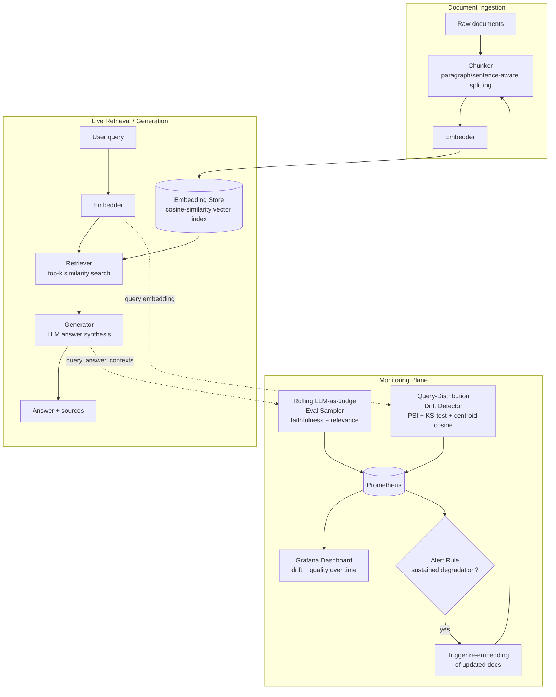

# driftguard-llm

**Catch silent RAG/LLM quality regressions before your users do.**


## The real problem

Teams ship RAG/LLM features to prod with no systematic way to detect when
retrieval or output quality silently degrades as source data and query
distributions shift. The vector index goes stale, users start asking about
things the corpus doesn't cover well anymore, or an upstream embedding
model gets swapped -- and nothing pages anyone. Hallucinations and bad
retrievals accumulate quietly for weeks until a customer complaint (or a
support-cost spike) forces someone to go digging, by which point there's no
record of *when* things started going wrong or *why*.

**driftguard-llm** is a small, real RAG service with a monitoring plane
bolted directly onto its hot path: every query's embedding feeds a
statistical drift detector, and a rolling sample of production responses is
scored by an LLM-as-judge harness for faithfulness and relevance. When
either signal degrades for long enough, an alert fires and can
automatically flag ingested documents for re-embedding.

## Architecture



Data flow: documents are ingested -> chunked -> embedded -> written to the
embedding store; live queries are embedded, retrieved against that store,
and answered by the generator. In parallel, the monitoring plane watches
every query embedding for distribution drift and periodically scores a
rolling sample of production responses with an LLM-as-judge, both feeding
Prometheus/Grafana and an alert rule that -- on sustained degradation --
kicks off re-embedding of the documents backing the affected traffic.

## How it works

### 1. Ingestion (`app/chunking.py`, `app/vector_store.py`)
Documents are split with paragraph/sentence-aware recursive chunking (the
same strategy LangChain's `RecursiveCharacterTextSplitter` uses), embedded,
and stored in a cosine-similarity vector index. The default index is exact
brute-force search over a SQLite-backed corpus -- correct and fast at the
hundreds-to-tens-of-thousands-of-chunks scale a solo/small RAG service
actually runs at; adapters for pgvector/Qdrant are the documented path to
scale further (see `requirements-optional.txt`).

### 2. Embeddings (`app/embeddings.py`)
The default `HashingEmbedder` is feature hashing over hashed word +
character-trigram features with a fixed random sign, followed by
L2-normalization -- a real, deterministic technique (the same "hashing
trick" behind scikit-learn's `HashingVectorizer` / Vowpal Wabbit), not a
random placeholder. It requires no network access, which is what keeps the
whole pipeline -- and its tests -- runnable offline while still producing a
genuinely structured embedding space where similar text lands closer
together. Swapping in real OpenAI embeddings is a one-line config change
(`DRIFTGUARD_EMBEDDER_BACKEND=openai`).

### 3. Generation (`app/llm.py`)
The default `ExtractiveLLM` composes answers by extracting the most
query-relevant sentences from retrieved context (classic extractive
summarization) -- deterministic, network-free, and quality-sensitive to
retrieval, which is exactly the property needed for the eval harness and
drift tests to mean anything. `OpenAILLM` is the pluggable production
backend.

### 4. Embedding-space drift detection (`app/drift.py`)
The first `DRIFTGUARD_REF_WINDOW` query embeddings become the baseline;
every later embedding lands in a rolling "current" window compared against
it via three complementary techniques:
- **Centroid cosine similarity** -- cheap, catches gross topic shift.
- **Population Stability Index (PSI)** on random 1D projections of the
  embeddings, binned against reference-derived quantiles (the same metric
  Evidently AI and most production drift tooling use for numeric/embedding
  drift; adaptive bin count so small windows don't manufacture noise).
- **Kolmogorov-Smirnov two-sample test** on the same projections, a
  distribution-free significance test aggregated across projections.

A synthetic drift-injection test suite (`tests/test_drift.py`) validates the
detector against controlled mean-shift, variance-shift, and no-drift
scenarios before trusting it on real traffic.

### 5. LLM-as-judge eval harness (`app/judge.py`, `app/monitoring.py`)
A configurable fraction (`DRIFTGUARD_EVAL_SAMPLE_RATE`) of production
(query, answer, contexts) triples is scored for **faithfulness** (is the
answer grounded in retrieved context?) and **relevance** (does it address
the query?), kept in a rolling window whose mean feeds Prometheus. The
default `HeuristicJudge` blends embedding similarity with content-word
overlap -- deterministic and offline-safe, what the test suite exercises.
`OpenAIJudge` is the real LLM-as-judge backend (prompts a chat model,
parses structured JSON), wired in via `DRIFTGUARD_JUDGE_BACKEND=openai`.

### 6. Alerting + auto re-embed (`app/alerts.py`)
The alert engine debounces both signals: it requires
`DRIFTGUARD_ALERT_BREACHES` *consecutive* unhealthy monitoring ticks
(drift status != ok, or rolling faithfulness/relevance below threshold)
before firing, avoiding pages on a single noisy sample. On firing, it
invokes a re-embed hook that flags all currently-ingested documents for
re-embedding (`POST /admin/reembed` actually re-runs ingestion).

### 7. Metrics + dashboard (`app/metrics.py`, `grafana/`)
Every signal above is a Prometheus gauge/counter exposed at `GET /metrics`.
`grafana/dashboards/driftguard.json` graphs drift status, mean PSI, KS
reject fraction, centroid cosine similarity, rolling faithfulness/relevance,
query volume/latency, and alert/re-embed counts. `prometheus/alert_rules.yml`
mirrors the in-app alert rule as real Prometheus alerting rules.

## Quick start

```bash
python3.11 -m venv .venv && source .venv/bin/activate
pip install -r requirements-dev.txt

uvicorn app.api:app --reload
# -> http://localhost:8000/docs
```

```bash
# Ingest a document
curl -s -X POST localhost:8000/ingest \
  -H 'content-type: application/json' \
  -d '{"text": "driftguard-llm detects embedding drift and scores answer quality.", "source": "demo"}'

# Query it
curl -s -X POST localhost:8000/query \
  -H 'content-type: application/json' \
  -d '{"query": "What does driftguard-llm detect?"}'

# Inspect current drift status / rolling eval scores / alert state
curl -s localhost:8000/admin/drift
curl -s localhost:8000/admin/eval
curl -s localhost:8000/admin/alerts

# Prometheus scrape target
curl -s localhost:8000/metrics
```

### Full local stack (optional, needs Docker)

```bash
docker compose up --build
# API:        http://localhost:8000/docs
# Prometheus: http://localhost:9090
# Grafana:    http://localhost:3000  (admin/admin, dashboard pre-provisioned)
```

## Running the tests

```bash
pip install -r requirements-dev.txt
python -m pytest -q             # 70 unit tests, fully offline/deterministic
ruff check app tests            # lint
```

The unit test suite is 100% network-free and Docker-free: it covers
chunking, the vector store, the deterministic embedder, the synthetic
drift-injection suite (mean-shift / variance-shift / no-drift scenarios
against `DriftDetector`), the LLM-as-judge scoring logic (grounded vs.
hallucinated vs. off-topic answers), the alert engine's debounce +
re-embed-trigger logic, the end-to-end RAG service, and the FastAPI routes.

Docker-dependent integration tests live in `tests/integration/` and are
**skipped by default** -- they only run if you explicitly opt in after
starting the docker-compose stack:

```bash
docker compose up -d
DRIFTGUARD_RUN_INTEGRATION=1 pytest tests/integration -m integration -q
```

CI (`.github/workflows/ci.yml`) runs lint + the full offline unit/eval
suite (plus a Docker build sanity check) on every PR.

## Configuration

All tunables are environment variables (see `app/config.py`), including
drift window sizes, PSI/KS thresholds, eval sample rate and quality
thresholds, alert debounce count, and which backend (`fake`/`heuristic` vs.
`openai`) powers embeddings, generation, and judging. Nothing requires a
secret to run in its default, fully offline mode.

## Project layout

```
app/
  chunking.py       # paragraph/sentence-aware text splitting
  embeddings.py     # HashingEmbedder (offline) / OpenAIEmbedder (pluggable)
  vector_store.py   # SQLite-backed cosine-similarity index
  llm.py            # ExtractiveLLM (offline) / OpenAILLM (pluggable)
  rag.py            # ingest + retrieve + generate, instrumented
  drift.py          # PSI / KS-test / centroid-cosine drift detector
  judge.py          # LLM-as-judge faithfulness/relevance scoring
  monitoring.py      # rolling windows, eval sampler, glue
  alerts.py         # debounced alert engine + re-embed trigger
  metrics.py        # Prometheus metric definitions
  api.py            # FastAPI app: /ingest /query /metrics /admin/*
tests/              # 70 offline unit tests + synthetic drift-injection suite
tests/integration/  # opt-in Docker-based integration tests (skipped by default)
grafana/            # provisioned datasource + dashboard JSON
prometheus/         # scrape config + alerting rules
```

### About the Maintainer
This project is currently maintained by Manmohan S. With a background in supply chain analytics and a strong foundation in data analysis using Python and SQL, Manmohan focuses on ensuring the continued reliability and performance of `driftguard-llm`. His experience in operational reporting and performance monitoring aligns with the project's goal of detecting and preventing quality regressions.

*   **Email:** manmohansangola1@gmail.com
*   **LinkedIn:** [Manmohan Sangola](https://www.linkedin.com/in/manmohan-sangola/)

## License

MIT, see [LICENSE](LICENSE).